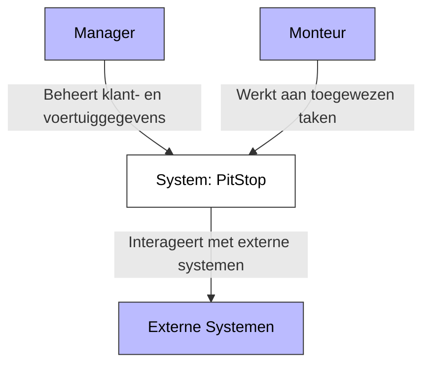
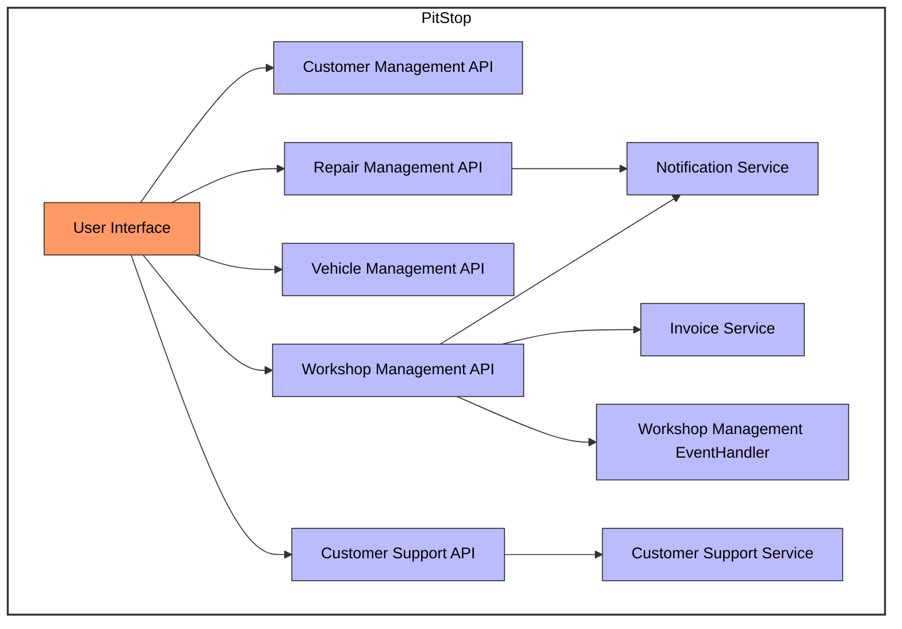

<style>
    .mermaid {
        background-color: white;
    }
</style>

# C4 Model PitStop

## Context Diagram

**Beschrijving:** Dit diagram toont de hoofdcomponenten van het PitStop-systeem en hun interacties. De manager beheert klant- en voertuiggegevens binnen het systeem, terwijl de monteur werkt aan toegewezen taken. Het systeem zelf (PitStop) interageert met externe systemen voor aanvullende functionaliteiten.



## Container

**Beschrijving:** Dit containerdiagram geeft een overzicht van de verschillende subsystemen binnen het PitStop-systeem. De WebApp fungeert als gebruikersinterface en communiceert met verschillende API's zoals Customer Management API, Repair Management API en Vehicle Management API. De Notification Service en Invoice Service ondersteunen de operationele processen, terwijl de Customer Support API en Service zorgen voor klantondersteuning.



## Component

**Beschrijving:** Dit componentdiagram biedt een gedetailleerd overzicht van de interne componenten van de Repair Management API en andere gerelateerde services binnen het PitStop-systeem. Het toont hoe verschillende componenten zoals controllers, commando's, data-toegangslagen, DTO's, gebeurtenissen, migraties, modellen, configuratiebestanden en databases met elkaar verbonden zijn en samenwerken om de functionaliteit van de API te ondersteunen. Het diagram toont ook de Notification Service en Customer Support API en Service. Alleen de componenten die tijdens dit project zijn gebouwd, worden in dit diagram beschreven.

```mermaid
graph TD
    subgraph RepairManagementAPI
        RepairManagementControllers[Controllers]
        RepairManagementCommands[Commands]
        RepairManagementDataAccess[DataAccess]
        RepairManagementDTO[DTO]
        RepairManagementEvents[Events]
        RepairManagementMigrations[Migrations]
        RepairManagementModel[Model]
        RepairManagementConfiguration[Configuration Files]
        RepairManagementProgram[Program.cs]
        RepairManagementDatabase[(Database)]

        RepairManagementProgram --> RepairManagementControllers
        RepairManagementProgram --> RepairManagementMigrations
        RepairManagementProgram --> RepairManagementConfiguration
        RepairManagementControllers --> RepairManagementCommands
        RepairManagementControllers --> RepairManagementEvents
        RepairManagementControllers --> RepairManagementDTO
        RepairManagementControllers --> RepairManagementModel
        RepairManagementMigrations --> RepairManagementModel
        RepairManagementMigrations --> RepairManagementDataAccess
        RepairManagementDataAccess --> RepairManagementDatabase

    end

    subgraph NotificationService
        NotificationChannels[Notification Channels]
        NotificationServiceEmailNotifier[Email Notifier]
        NotificationServiceSlackMessenger[Slack Messenger]
        NotificationServiceEvents[Events]
        NotificationServiceModel[Model]
        NotificationServiceTemplates[Slack Templates]
        NotificationServiceProgram[Program.cs]
        NotificationServiceWorker[NotificationService Worker]
        NotificationServiceRepository[(Database)]
        NotificationServiceProgram-->NotificationServiceWorker
        NotificationServiceWorker --> NotificationChannels
        NotificationServiceWorker --> NotificationServiceEvents
        NotificationServiceWorker --> NotificationServiceModel
        NotificationServiceWorker --> NotificationServiceRepository
        NotificationChannels --> NotificationServiceEmailNotifier
        NotificationChannels --> NotificationServiceSlackMessenger
        NotificationServiceSlackMessenger --> NotificationServiceTemplates
    end

    subgraph CustomerSupportAPI
        CustomerSupportAPIControllers[Controllers]
        CustomerSupportAPIEvents[Events]
        CustomerSupportAPIModels[Models]
        CustomerSupportAPIRepositories[Repositories]
        CustomerSupportAPIConfig[Configuration Files]
        CustomerSupportAPIProgram[Program.cs]
        CustomerSupportAPIRepository[(Database)]
        CustomerSupportAPIProgram --> CustomerSupportAPIControllers
        CustomerSupportAPIProgram --> CustomerSupportAPIConfig
        CustomerSupportAPIProgram --> CustomerSupportAPIRepositories
        CustomerSupportAPIControllers --> CustomerSupportAPIEvents
        CustomerSupportAPIControllers --> CustomerSupportAPIModels
        CustomerSupportAPIRepositories --> CustomerSupportAPIModels
        CustomerSupportAPIRepositories --> CustomerSupportAPIRepository
    end

    subgraph CustomerSupportService
        CustomerSupportServiceEvents[Events]
        EventHandlerWorker[EventHandlerWorker]
        CustomerSupportServiceModels[Models]
        CustomerSupportServiceRepositories[Repositories]
        CustomerSupportServiceProgram[Program.cs]
        CustomerSupportServiceConfig[Configuration Files]
        CustomerSupportServiceRepository[(Database)]
        CustomerSupportServiceProgram --> CustomerSupportServiceRepositories
        CustomerSupportServiceProgram --> EventHandlerWorker
        CustomerSupportServiceProgram --> CustomerSupportServiceConfig
        CustomerSupportServiceRepositories --> CustomerSupportServiceModels
        EventHandlerWorker --> CustomerSupportServiceEvents
        EventHandlerWorker --> CustomerSupportServiceModels
        EventHandlerWorker --> CustomerSupportServiceRepository
    end

    CustomerSupportAPI --> CustomerSupportService

    style RepairManagementAPI fill:#fff,stroke:#333,stroke-width:2px,color:#000000
    style RepairManagementControllers fill:#bbf,stroke:#333,stroke-width:1px,color:#000000
    style RepairManagementCommands fill:#bfb,stroke:#333,stroke-width:1px,color:#000000
    style RepairManagementDataAccess fill:#bfb,stroke:#333,stroke-width:1px,color:#000000
    style RepairManagementDTO fill:#fbb,stroke:#333,stroke-width:1px,color:#000000
    style RepairManagementEvents fill:#f9f,stroke:#333,stroke-width:1px,color:#000000
    style RepairManagementMigrations fill:#ff9,stroke:#333,stroke-width:1px,color:#000000
    style RepairManagementModel fill:#9bf,stroke:#333,stroke-width:1px,color:#000000
    style RepairManagementConfiguration fill:#f99,stroke:#333,stroke-width:1px,color:#000000
    style RepairManagementProgram fill:#9ff,stroke:#333,stroke-width:1px,color:#000000
    style RepairManagementDatabase fill:#cfc,stroke:#333,stroke-width:1px,color:#000000

    style NotificationService fill:#fff,stroke:#333,stroke-width:2px,color:#000000
    style NotificationChannels fill:#bbf,stroke:#333,stroke-width:1px,color:#000000
    style NotificationServiceEmailNotifier fill:#bfb,stroke:#333,stroke-width:1px,color:#000000
    style NotificationServiceSlackMessenger fill:#fbb,stroke:#333,stroke-width:1px,color:#000000
    style NotificationServiceEvents fill:#f9f,stroke:#333,stroke-width:1px,color:#000000
    style NotificationServiceModel fill:#9bf,stroke:#333,stroke-width:1px,color:#000000
    style NotificationServiceTemplates fill:#ff9,stroke:#333,stroke-width:1px,color:#000000
    style NotificationServiceProgram fill:#9ff,stroke:#333,stroke-width:1px,color:#000000
    style NotificationServiceRepository fill:#cfc,stroke:#333,stroke-width:1px,color:#000000
    style NotificationServiceWorker fill:#bbf,stroke:#333,stroke-width:1px,color:#000000

    style CustomerSupportAPI fill:#fff,stroke:#333,stroke-width:2px,color:#000000
    style CustomerSupportAPIProgram fill:#9ff,stroke:#333,stroke-width:1px,color:#000000
    style CustomerSupportAPIConfig fill:#f99,stroke:#333,stroke-width:1px,color:#000000
    style CustomerSupportAPIRepository fill:#cfc,stroke:#333,stroke-width:1px,color:#000000
    style CustomerSupportAPIRepositories fill:#bbf,stroke:#333,stroke-width:1px,color:#000000
    style CustomerSupportAPIControllers fill:#bbf,stroke:#333,stroke-width:1px,color:#000000
    style CustomerSupportAPIEvents fill:#f9f,stroke:#333,stroke-width:1px,color:#000000
    style CustomerSupportAPIModels fill:#9bf,stroke:#333,stroke-width:1px,color:#000000
 
    style CustomerSupportService fill:#fff,stroke:#333,stroke-width:2px,color:#000000
    style CustomerSupportServiceProgram fill:#9ff,stroke:#333,stroke-width:1px,color:#000000
    style CustomerSupportServiceConfig fill:#f99,stroke:#333,stroke-width:1px,color:#000000
    style CustomerSupportServiceRepository fill:#cfc,stroke:#333,stroke-width:1px,color:#000000
    style CustomerSupportServiceRepositories fill:#bbf,stroke:#333,stroke-width:1px,color:#000000
    style CustomerSupportServiceEvents fill:#f9f,stroke:#333,stroke-width:1px,color:#000000
    style CustomerSupportServiceModels fill:#9bf,stroke:#333,stroke-width:1px,color:#000000
    style EventHandlerWorker fill:#bbf,stroke:#333,stroke-width:1px,color:#000000
```



## Legenda

| Kleur | Betekenis |
|-------|-----------|
| <span style="color:#bbf">Lichtblauw (#bbf)</span>  | Algemene componenten |
| <span style="color:#f96">Oranje (#f96)</span>  | Gebruikersinterface |
| <span style="color:#bfb">Lichtgroen (#bfb)</span>  | Commando- en data-toegangslagen |
| <span style="color:#fbb">Lichtroze (#fbb)</span>  | Data Transfer Objecten (DTO) |
| <span style="color:#f9f">Lichtpaars (#f9f)</span>  | Gebeurtenissen (Events) |
| <span style="color:#ff9">Geel (#ff9)</span>  | Migraties en sjablonen |
| <span style="color:#9bf">Lichtblauw (#9bf)</span>  | Modellen |
| <span style="color:#f99">Lichtrood (#f99)</span>  | Configuratiebestanden |
| <span style="color:#9ff">Lichtblauw (#9ff)</span>  | Program.cs-bestanden |
| <span style="color:#cfc">Lichtgroen (#cfc)</span>  | Databases |
| <span style="color:#fff">Wit (#fff)</span>  | Hoofdcomponenten en sub-systemen |

[//]: # (## Code)

[//]: # ()
[//]: # (```mermaid)

[//]: # (graph TD)

[//]: # (    subgraph RepairManagementAPI)

[//]: # (        RepairController[RepairController.cs] --> HandleRepairRequest[HandleRepairRequest])

[//]: # (        RepairRepository[RepairRepository.cs] --> SaveRepairOrder[SaveRepairOrder])

[//]: # (        EventPublisher[EventPublisher.cs] --> PublishRepairEvent[PublishRepairEvent])

[//]: # (    end)

[//]: # ()
[//]: # (    subgraph CustomerManagementAPI)

[//]: # (        CustomerRepository[CustomerRepository.cs] --> GetCustomerById[GetCustomerById])

[//]: # (        CustomerRepository --> AddCustomer[AddCustomer])

[//]: # (    end)

[//]: # ()
[//]: # (    subgraph Notification_Service)

[//]: # (        NotificationSender[NotificationSender.java])

[//]: # (    end)

[//]: # ()
[//]: # ()
[//]: # (    style RepairManagementAPI fill:#ccf,stroke:#333,stroke-width:2px)

[//]: # (    style CustomerManagementAPI fill:#ccf,stroke:#333,stroke-width:2px)

[//]: # (    style Notification_Service fill:#ccf,stroke:#333,stroke-width:2px)

[//]: # (```)