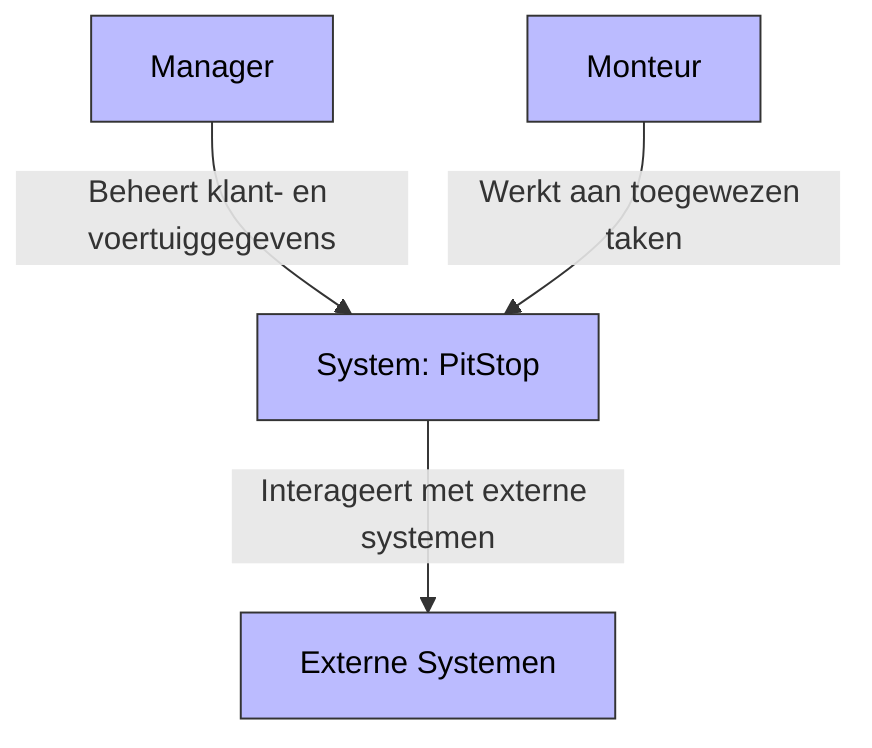

<style>
    .mermaid {
        background-color: white;
    }
</style>

# C4 Model PitStop

## Context Diagram



## Container


## Component

```mermaid
graph TD
    subgraph RepairManagementAPI
        RepairManagementControllers[Controllers]
        RepairManagementCommands[Commands]
        RepairManagementDataAccess[DataAccess]
        RepairManagementDTO[DTO]
        RepairManagementEvents[Events]
        RepairManagementMigrations[Migrations]
        RepairManagementModel[Model]
        RepairManagementConfiguration[Configuration Files]
        RepairManagementProgram[Program.cs]
        RepairManagementDatabase[(Database)]

        RepairManagementProgram --> RepairManagementControllers
        RepairManagementProgram --> RepairManagementMigrations
        RepairManagementProgram --> RepairManagementConfiguration
        RepairManagementControllers --> RepairManagementCommands
        RepairManagementControllers --> RepairManagementEvents
        RepairManagementControllers --> RepairManagementDTO
        RepairManagementControllers --> RepairManagementModel
        RepairManagementMigrations --> RepairManagementModel
        RepairManagementMigrations --> RepairManagementDataAccess
        RepairManagementDataAccess --> RepairManagementDatabase

    end

    subgraph NotificationService
        NotificationChannels[Notification Channels]
        NotificationServiceEmailNotifier[Email Notifier]
        NotificationServiceSlackMessenger[Slack Messenger]
        NotificationServiceEvents[Events]
        NotificationServiceModel[Model]
        NotificationServiceTemplates[Slack Templates]
        NotificationServiceProgram[Program.cs]
        NotificationServiceWorker[NotificationService Worker]
        NotificationServiceRepository[(Database)]
        NotificationServiceProgram-->NotificationServiceWorker
        NotificationServiceWorker --> NotificationChannels
        NotificationServiceWorker --> NotificationServiceEvents
        NotificationServiceWorker --> NotificationServiceModel
        NotificationServiceWorker --> NotificationServiceRepository
        NotificationChannels --> NotificationServiceEmailNotifier
        NotificationChannels --> NotificationServiceSlackMessenger
        NotificationServiceSlackMessenger --> NotificationServiceTemplates
    end

    subgraph CustomerSupportAPI
        CustomerSupportAPIControllers[Controllers]
        CustomerSupportAPIEvents[Events]
        CustomerSupportAPIModels[Models]
        CustomerSupportAPIRepositories[Repositories]
        CustomerSupportAPIConfig[Configuration Files]
        CustomerSupportAPIProgram[Program.cs]
        CustomerSupportAPIRepository[(Database)]
        CustomerSupportAPIProgram --> CustomerSupportAPIControllers
        CustomerSupportAPIProgram --> CustomerSupportAPIConfig
        CustomerSupportAPIProgram --> CustomerSupportAPIRepositories
        CustomerSupportAPIControllers --> CustomerSupportAPIEvents
        CustomerSupportAPIControllers --> CustomerSupportAPIModels
        CustomerSupportAPIRepositories --> CustomerSupportAPIModels
        CustomerSupportAPIRepositories --> CustomerSupportAPIRepository
    end

    subgraph CustomerSupportService
        CustomerSupportServiceEvents[Events]
        EventHandlerWorker[EventHandlerWorker]
        CustomerSupportServiceModels[Models]
        CustomerSupportServiceRepositories[Repositories]
        CustomerSupportServiceProgram[Program.cs]
        CustomerSupportServiceConfig[Configuration Files]
        CustomerSupportServiceRepository[(Database)]
        CustomerSupportServiceProgram --> CustomerSupportServiceRepositories
        CustomerSupportServiceProgram --> EventHandlerWorker
        CustomerSupportServiceProgram --> CustomerSupportServiceConfig
        CustomerSupportServiceRepositories --> CustomerSupportServiceModels
        EventHandlerWorker --> CustomerSupportServiceEvents
        EventHandlerWorker --> CustomerSupportServiceModels
        EventHandlerWorker --> CustomerSupportServiceRepository
    end

    CustomerSupportAPI --> CustomerSupportService

    style RepairManagementAPI fill:#fff,stroke:#333,stroke-width:2px,color:#000000
    style RepairManagementControllers fill:#bbf,stroke:#333,stroke-width:1px,color:#000000
    style RepairManagementCommands fill:#bbf,stroke:#333,stroke-width:1px,color:#000000
    style RepairManagementDataAccess fill:#bfb,stroke:#333,stroke-width:1px,color:#000000
    style RepairManagementDTO fill:#fbb,stroke:#333,stroke-width:1px,color:#000000
    style RepairManagementEvents fill:#f9f,stroke:#333,stroke-width:1px,color:#000000
    style RepairManagementMigrations fill:#ff9,stroke:#333,stroke-width:1px,color:#000000
    style RepairManagementModel fill:#9bf,stroke:#333,stroke-width:1px,color:#000000
    style RepairManagementConfiguration fill:#f99,stroke:#333,stroke-width:1px,color:#000000
    style RepairManagementProgram fill:#9ff,stroke:#333,stroke-width:1px,color:#000000
    style RepairManagementDatabase fill:#cfc,stroke:#333,stroke-width:1px,color:#000000

    style NotificationService fill:#fff,stroke:#333,stroke-width:2px,color:#000000
    style NotificationChannels fill:#bbf,stroke:#333,stroke-width:1px,color:#000000
    style NotificationServiceEmailNotifier fill:#bfb,stroke:#333,stroke-width:1px,color:#000000
    style NotificationServiceSlackMessenger fill:#fbb,stroke:#333,stroke-width:1px,color:#000000
    style NotificationServiceEvents fill:#f9f,stroke:#333,stroke-width:1px,color:#000000
    style NotificationServiceModel fill:#9bf,stroke:#333,stroke-width:1px,color:#000000
    style NotificationServiceTemplates fill:#ff9,stroke:#333,stroke-width:1px,color:#000000
    style NotificationServiceProgram fill:#9ff,stroke:#333,stroke-width:1px,color:#000000
    style NotificationServiceRepository fill:#cfc,stroke:#333,stroke-width:1px,color:#000000
    style NotificationServiceWorker fill:#bbf,stroke:#333,stroke-width:1px,color:#000000

    style CustomerSupportAPI fill:#fff,stroke:#333,stroke-width:2px,color:#000000
    style CustomerSupportAPIProgram fill:#9ff,stroke:#333,stroke-width:1px,color:#000000
    style CustomerSupportAPIConfig fill:#f99,stroke:#333,stroke-width:1px,color:#000000
    style CustomerSupportAPIRepository fill:#cfc,stroke:#333,stroke-width:1px,color:#000000
    style CustomerSupportAPIRepositories fill:#bbf,stroke:#333,stroke-width:1px,color:#000000
    style CustomerSupportAPIControllers fill:#cfc,stroke:#333,stroke-width:1px,color:#000000
    style CustomerSupportAPIEvents fill:#f9f,stroke:#333,stroke-width:1px,color:#000000
    style CustomerSupportAPIModels fill:#9bf,stroke:#333,stroke-width:1px,color:#000000
 
    style CustomerSupportService fill:#fff,stroke:#333,stroke-width:2px,color:#000000
    style CustomerSupportServiceProgram fill:#9ff,stroke:#333,stroke-width:1px,color:#000000
    style CustomerSupportServiceConfig fill:#f99,stroke:#333,stroke-width:1px,color:#000000
    style CustomerSupportServiceRepository fill:#cfc,stroke:#333,stroke-width:1px,color:#000000
    style CustomerSupportServiceRepositories fill:#bbf,stroke:#333,stroke-width:1px,color:#000000
    style CustomerSupportServiceEvents fill:#f9f,stroke:#333,stroke-width:1px,color:#000000
    style CustomerSupportServiceModels fill:#9bf,stroke:#333,stroke-width:1px,color:#000000
    style EventHandlerWorker fill:#bbf,stroke:#333,stroke-width:1px,color:#000000
```



[//]: # (## Code)

[//]: # ()
[//]: # (```mermaid)

[//]: # (graph TD)

[//]: # (    subgraph RepairManagementAPI)

[//]: # (        RepairController[RepairController.cs] --> HandleRepairRequest[HandleRepairRequest])

[//]: # (        RepairRepository[RepairRepository.cs] --> SaveRepairOrder[SaveRepairOrder])

[//]: # (        EventPublisher[EventPublisher.cs] --> PublishRepairEvent[PublishRepairEvent])

[//]: # (    end)

[//]: # ()
[//]: # (    subgraph CustomerManagementAPI)

[//]: # (        CustomerRepository[CustomerRepository.cs] --> GetCustomerById[GetCustomerById])

[//]: # (        CustomerRepository --> AddCustomer[AddCustomer])

[//]: # (    end)

[//]: # ()
[//]: # (    subgraph Notification_Service)

[//]: # (        NotificationSender[NotificationSender.java])

[//]: # (    end)

[//]: # ()
[//]: # ()
[//]: # (    style RepairManagementAPI fill:#ccf,stroke:#333,stroke-width:2px)

[//]: # (    style CustomerManagementAPI fill:#ccf,stroke:#333,stroke-width:2px)

[//]: # (    style Notification_Service fill:#ccf,stroke:#333,stroke-width:2px)

[//]: # (```)