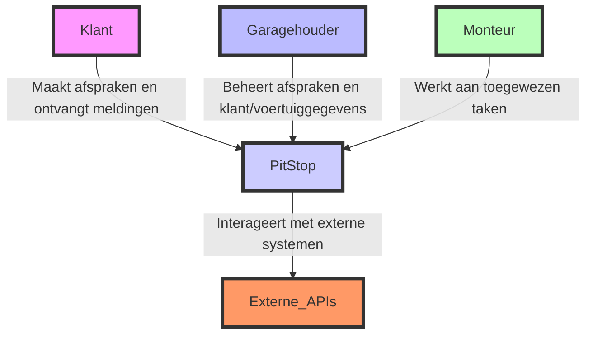
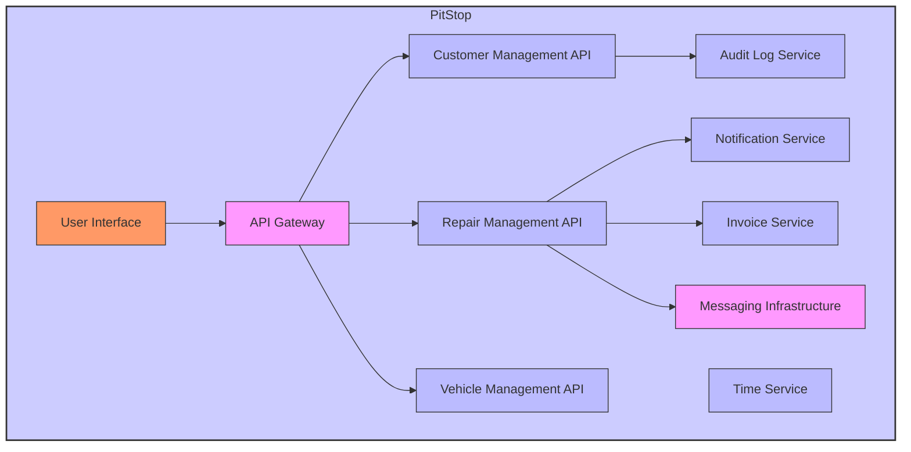
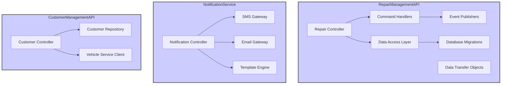
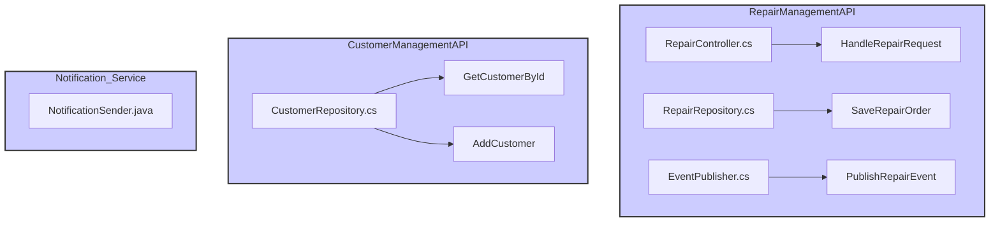

# C4 Model voor PitStop

## Context Diagram (C1)

```mermaid
graph TD
    Klant -->|Maakt afspraken en ontvangt meldingen| PitStop
    Garagehouder -->|Beheert afspraken en klant/voertuiggegevens| PitStop
    Monteur -->|Werkt aan toegewezen taken| PitStop
    PitStop -->|Interageert met externe systemen| Externe_APIs

    style Klant fill:#f9f,stroke:#333,stroke-width:4px
    style Garagehouder fill:#bbf,stroke:#333,stroke-width:4px
    style Monteur fill:#bfb,stroke:#333,stroke-width:4px
    style Externe_APIs fill:#f96,stroke:#333,stroke-width:4px
    style PitStop fill:#ccf,stroke:#333,stroke-width:4px
```

```mermaid
graph TD
    subgraph PitStop
        APIGateway[API Gateway]
        CustomerManagementAPI[Customer Management API]
        RepairManagementAPI[Repair Management API]
        VehicleManagementAPI[Vehicle Management API]
        NotificationService[Notification Service]
        InvoiceService[Invoice Service]
        AuditlogService[Audit Log Service]
        TimeService[Time Service]
        WebApp[User Interface]
        InfrastructureMessaging[Messaging Infrastructure]

        APIGateway --> CustomerManagementAPI
        APIGateway --> RepairManagementAPI
        APIGateway --> VehicleManagementAPI
        RepairManagementAPI --> NotificationService
        RepairManagementAPI --> InvoiceService
        CustomerManagementAPI --> AuditlogService
        WebApp --> APIGateway
        RepairManagementAPI --> InfrastructureMessaging
    end

    style PitStop fill:#ccf,stroke:#333,stroke-width:2px
    style APIGateway fill:#f9f,stroke:#333,stroke-width:1px
    style CustomerManagementAPI fill:#bbf,stroke:#333,stroke-width:1px
    style RepairManagementAPI fill:#bbf,stroke:#333,stroke-width:1px
    style VehicleManagementAPI fill:#bbf,stroke:#333,stroke-width:1px
    style NotificationService fill:#bbf,stroke:#333,stroke-width:1px
    style InvoiceService fill:#bbf,stroke:#333,stroke-width:1px
    style AuditlogService fill:#bbf,stroke:#333,stroke-width:1px
    style TimeService fill:#bbf,stroke:#333,stroke-width:1px
    style WebApp fill:#f96,stroke:#333,stroke-width:1px
    style InfrastructureMessaging fill:#f9f,stroke:#333,stroke-width:1px
```

```mermaid
graph TD
    subgraph RepairManagementAPI
        RepairController[Repair Controller]
        Commands[Command Handlers]
        DataAccess[Data Access Layer]
        DTOs[Data Transfer Objects]
        Events[Event Publishers]
        Migrations[Database Migrations]

        RepairController --> Commands
        RepairController --> DataAccess
        Commands --> Events
        DataAccess --> Migrations
    end

    subgraph NotificationService
        NotificationController[Notification Controller]
        SMSGateway[SMS Gateway]
        EmailGateway[Email Gateway]
        TemplateEngine[Template Engine]

        NotificationController --> SMSGateway
        NotificationController --> EmailGateway
        NotificationController --> TemplateEngine
    end

    subgraph CustomerManagementAPI
        CustomerController[Customer Controller]
        CustomerRepository[Customer Repository]
        VehicleServiceClient[Vehicle Service Client]
        
        CustomerController --> CustomerRepository
        CustomerController --> VehicleServiceClient
    end

    style RepairManagementAPI fill:#ccf,stroke:#333,stroke-width:2px
    style NotificationService fill:#ccf,stroke:#333,stroke-width:2px
    style CustomerManagementAPI fill:#ccf,stroke:#333,stroke-width:2px

```

```mermaid
graph TD
    subgraph RepairManagementAPI
        RepairController[RepairController.cs] --> HandleRepairRequest[HandleRepairRequest]
        RepairRepository[RepairRepository.cs] --> SaveRepairOrder[SaveRepairOrder]
        EventPublisher[EventPublisher.cs] --> PublishRepairEvent[PublishRepairEvent]
    end

    subgraph CustomerManagementAPI
        CustomerRepository[CustomerRepository.cs] --> GetCustomerById[GetCustomerById]
        CustomerRepository --> AddCustomer[AddCustomer]
    end

    subgraph Notification_Service
        NotificationSender[NotificationSender.java]
    end


    style RepairManagementAPI fill:#ccf,stroke:#333,stroke-width:2px
    style CustomerManagementAPI fill:#ccf,stroke:#333,stroke-width:2px
    style Notification_Service fill:#ccf,stroke:#333,stroke-width:2px
```